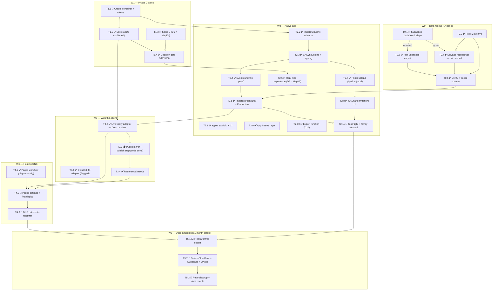

# Apple Migration — Task Breakdown

**Companion to:** [APPLE-MIGRATION-PLAN.md](./APPLE-MIGRATION-PLAN.md) (the *what/why*) and [APPLE-MIGRATION-RUNBOOK.md](./APPLE-MIGRATION-RUNBOOK.md) (the *manual steps only Christopher can do*).
**Purpose:** the plan broken into self-contained subtasks sized for delegation to coding agents (Opus 4.8 class). Each task lists its inputs, file scope, acceptance criteria, and a prompt seed. Tasks marked 🧑 need Christopher personally (credentials/accounts); tasks marked 🤖 are agent-executable; 🤝 = agent does the work, Christopher supplies a token/click first.

**Status legend:** ✅ done · 🔄 in flight · ⬜ open · ⛔ blocked (see `needs:`).

> **Where the migration actually stands (updated 2026-07-25).** The migration itself is **finished**: CloudKit sync is live (D4 = custom `CKRecord` sync via `CKSyncEngine`, zone-per-journey), the family archive is imported into **Production** (1559 `CKRecord`s of *all* types — 3 journeys + 18 waypoints + 1538 photos — carrying 3070 `CKAsset`s: 1538 originals + 1529 thumbnails + 3 journey heroes), the schema is promoted, the web client is CloudKit-only with Supabase retired, and the showcase publishes. D5 (MapKit) and D6 (frozen read-mostly web) are both decided. What remains here is **operator work only** — TestFlight testers, Pages/DNS cutover, Phase-5 decommission — all marked 🧑 below.
>
> Product work has moved on to commercialization: see **[COMMERCIALIZATION-PLAN.md](./COMMERCIALIZATION-PLAN.md)** for the forward plan and **W7** at the bottom of this file for milestone status (M1–M10 + draw-on-map). The nightly build log ran 2026-07-21 → 24 across five nights; test suite is **602 native + 402 web, CI green** — `grep -rn 'func test' apple/AkashicTests | wc -l` gives the native figure, `npx vitest --run` the web one. (The simulator run reported 599 executed when last measured; the three-test gap is tests added since that measurement.)

---

## ⚠️ Reality corrections discovered during recon (2026-07-21)

Facts the plan didn't know, now baked into the tasks below:

1. **The Supabase project is dark.** `pbqvnxeldpgvcrdbxcvr.supabase.co` returns NXDOMAIN (verified against 1.1.1.1 too). The repo has been dormant since 2025-12-26; Supabase free tier pauses projects after ~1 week inactivity and they become deletion-eligible after ~90 days. The production site akashic.no still serves its static bundle (Cloudflare Pages) with that dead URL baked in — **the live app's data layer is currently broken**. The Cloudflare Worker + R2 bucket are alive (MCP `ping` verified) → all photo/video bytes are safe. At risk (Postgres-only): captions, day comments, photo↔day assignments, weather/fun-facts/POI/historical-sites payloads, journey members, post-Nov-2025 route edits. **Workstream W0 (data rescue) now precedes everything and is Christopher's most urgent action.** — **UPDATE (night 2, 2026-07-22): RESOLVED.** The project was *paused*, not deleted; Christopher resumed it (~23:00, 2026-07-21) and the full rescue (Postgres export + complete R2 archive + verification) completed — see **W0** below. W0 is done and no longer blocks Phase 2 data.
2. **Partial offline backup recovered from git history** into `apple/Fixtures/recovered/` (`kilimanjaro.json` 188 route pts + 8 camps, `mountKenya.json`, `incaTrail.json`, `trekConfig.ts` — state as of 2025-11-26, the day the JSON files were deleted in favor of Supabase).
3. **No react-router.** The dependency exists but is never imported; navigation is `?journey=&day=` query params. The Pages `404.html` fallback is still useful, but the plan's SPA-routing rationale is wrong, and `react-router-dom` can be dropped from `package.json` at cleanup.
4. **`journeys.gpx_url` is NULL everywhere.** Routes live in `journeys.route` JSONB. The plan's `gpx: CKAsset` has no source data; export can *generate* GPX from the LineString if wanted (D10), but nothing to copy.
5. **The plan's CloudKit model omitted real columns** added by later migrations: `waypoints.weather/fun_facts/points_of_interest/historical_sites/arrival_time/departure_time/date_visited/route_distance_km/route_point_index`, `photos.rotation/location_source/media_type/duration/is_hero/uploaded_by`, `journeys.journey_type/default_zoom`. The authoritative mapping is now `apple/CloudKit/MAPPING.md` (generated from the migrations, not from ARCHITECTURE.md, whose schema block is stale).
6. **`photos.coordinates` has two encodings** in the DB (GeoJSON `{type:'Point',coordinates:[lng,lat]}` from the bulk script vs bare `[lng,lat]` from browser uploads). All import/export code normalizes both.
7. **Media contract quirk:** the web app's `getMediaUrl(path)` is synchronous and token-in-query; CloudKit assets are pre-signed absolute URLs. Solved by an absolute-URL passthrough in `buildMediaUrl` (harmless in Supabase mode).
8. **Secrets hygiene:** the Supabase service-role key exists in local untracked files (`.env` in the main checkout; embedded in `.claude/settings.local.json` permission strings). Not in git (verified `git ls-files` in repo + worktree). Rotate-or-retire is a runbook item; both die with the project in Phase 5 anyway.
9. **Toolchain on this machine:** Xcode 26.6 + iOS 26.5 simulators + `xcodegen` + `xcrun cktool` 1.0.23001 — native code can be built/tested/screenshotted locally. Plan's iOS 17 minimum stands (Open Question 1 still needs the oldest-family-device check).

---

## Dependency graph

---

## W0 — Data rescue (✅ complete — night 2, 2026-07-21 → 22)

> **✅ RESOLVED.** The Supabase project was **paused**, not deleted. Christopher resumed it (~23:00, 2026-07-21) and the full rescue ran end-to-end:
> - **Postgres export:** 3 journeys · 18 waypoints · **1538 photos** · 3 profiles/members · **0 day_comments**.
> - **R2 archive:** **8 147 objects, 16.41 GB** pulled in full.
> - **`verifyExport` PASSED:** **0 missing originals/thumbs**; spot-checks clean.
> - **Archive location:** `/Users/cher/Privat/AkashicExport-20260722` (duplicated offline).
> - **Orphans:** verification flagged **2 747 orphan R2 objects** = old/pre-migration formats and leftovers, referenced by no DB row; spot-checked clean → expected and harmless (dropped at Phase 5, never re-imported).
> - **Web app re-verified** end-to-end after resume (E2E chromium 16 pass / mobile-chrome 23 pass); **akashic.no is live again**.
> - **T0.4 salvage was not needed.** Sources are now treated **read-only until Phase 5**.

### T0.1 ✅ Supabase dashboard triage — **done (paused → resumed)**
- **Outcome:** project `pbqvnxeldpgvcrdbxcvr` found **Paused**; resumed ~23:00 on 2026-07-21; rows confirmed in Table Editor (`journeys`, `waypoints`, `photos`, `profiles`, `journey_members`; `day_comments` empty). Answer recorded: **`restored`**.

### T0.2 ✅ Run the Supabase export — **done**
- **Outcome:** `exportFromSupabase.ts` produced JSON per table + manifest with sha256s. Row counts: **3 journeys / 18 waypoints / 1538 photos / 3 profiles + members / 0 day_comments** (match the dashboard). Archived to `/Users/cher/Privat/AkashicExport-20260722` and duplicated offline.

### T0.3 ✅ Pull the R2 media archive — **done**
- **Outcome:** `pullR2Archive.ts` inventoried and downloaded **8 147 objects / 16.41 GB**; inventory count == downloaded count; photo spot-checks open; archive duplicated offline (same bundle path as T0.2).

### ~~T0.4 🤖 Salvage reconstruction~~ — **not needed (Supabase was alive)**
- Skipped: this path only runs if Postgres is unrecoverable. Since T0.1 came back `restored`, the real export (T0.2) superseded it. `scripts/export/salvageReconstruct.ts` remains in the repo as a break-glass tool, unused.

### T0.5 ✅ Verify + freeze — **done (PASSED)**
- **Outcome:** `verifyExport.ts` cross-checked DB rows ↔ R2 objects both directions + thumb coverage + checksums → **0 missing originals/thumbs**. The **2 747 orphan R2 objects** are explained (old formats / pre-migration leftovers, spot-checked clean). A dated pre-migration archive bundle exists offline. Supabase + R2 are now **read-only until Phase 5**.

---

## W1 — Phase 0 gates (spikes → decisions)

### T1.1 ✅ Container + tokens (RUNBOOK §1–3) — done 2026-07-22
✅ App ID `no.akashic.app` + `no.akashic.app.widgets`, container `iCloud.no.akashic`, App Group `group.no.akashic` registered (team 9LVCB72DT8, via Xcode automatic signing); ✅ cktool management token (was already saved); ✅ CloudKit JS web API token created and verified live (anonymous public-DB query succeeds; token stored only in gitignored files).

### T1.2 ✅ Execute Spike A — done 2026-07-22 (D6 confirmed)
- **Built tonight:** `spikes/cloudkit-js/index.html` + README (4 test panels: private DB, shared DB, share-accept, public DB; PASS/FAIL badges; full error surfacing). CloudKit JS confirmed to load and error-path verified with placeholder token.
- **Do:** paste the API token, serve `python3 -m http.server 8000`, click through the checklist with a real share from a second Apple ID (needs T2.2 toy data or any test records).
- **Accept:** panels 1–4 each PASS/FAIL recorded in the README's matrix; especially **shared-DB read** and **share accept** — if those fail, D6 falls back to "public showcase only" web (plan risk table row 1).
- **Watch:** the spike hedges on share-acceptance API variants (CloudKit JS is thin there — an "Inspect share API surface" button dumps what the build exposes). A red badge may mean "API too thin", not "impossible" — check the dumped surface before concluding.

### T1.3 ✅ Evaluate Spike B — done 2026-07-22 (D5 = MapKit)
- **Built tonight:** `apple/Spikes/MapKitGlobe/` — standalone SwiftUI app; globe with idle rotation (3.5 s delay, ~2°/s westward), fly-in choreography (globe → route overview pitch 60/bearing −20 → per-day legs pitch 55 with route-derived heading), white route polyline + glow, cyan day segment, amber camp badges; hybrid/imagery toggle; screenshots in `Screenshots/`.
- **Do (Christopher, 10 min):** run it in the simulator (`cd apple/Spikes/MapKitGlobe && xcodegen && open`), judge the globe against Mapbox side by side (akashic.no won't load data now — use the recorded look or local dev with `VITE_E2E_TEST_MODE`).
- **Accept:** D5 verdict written into APPLE-MIGRATION-PLAN.md: MapKit / Mapbox-iOS-SDK fallback. The spike README contains the agent's technical assessment of gaps (fog/exaggeration/easing control).

### T1.4 ✅ Decision-gate write-up — done 2026-07-22
Consolidate D4 (NSPCKC vs CKSyncEngine — informed by how the scaffold's Core Data layer feels), D5 (T1.3), D6 (T1.2) into the plan; unblocks T2.6.

---

## W2 — Native app

### T2.1 ✅ Scaffold (done tonight — see `apple/README.md`)
XcodeGen project (iOS 17, Swift lang mode 5), Core Data model mirroring the REAL schema (all 4 entities incl. the columns the plan missed), PersistenceController with `.cloudKit`/`.local`/`.fixtures` modes, fixture-seeded read-only UI (journey list → detail → days/stats + flat map placeholder), unit tests, CI workflow `apple-ci.yml`, simulator-verified with screenshots in `apple/Docs/`.

### T2.2 ✅ Import the CloudKit schema (RUNBOOK §2) — done 2026-07-22
Schema validated and imported to **Development**; round-trip export confirms all six record types live. One syntax fix applied to `schema.ckdb`: `LIST<STRING>` (not `STRING LIST`). Remaining for Spike A: a toy record set (create in CloudKit Console, or wait for the T2.5 importer).

### T2.3 ✅ Activate CloudKit sync + signing — done 2026-07-22 (**D4 = custom `CKRecord` sync via `CKSyncEngine`**, option (a) below)
- **Needs:** T2.2 + Xcode Team set (RUNBOOK §4).
- **Do (agent, after Christopher sets the team):** flip `PersistenceController` to `.cloudKit`, enable the entitlements config, run on device/simulator with an iCloud account, confirm records appear in CloudKit Console Development.
- **Accept:** creating a Journey in-app produces a `Journey` record in a `journey-<uuid>` custom zone (zone-per-journey per D3). **This is the single biggest technical decision left**, and it is wider than zones: the scaffold's placeholder NSPersistentCloudKitContainer would generate its *own* schema (`CD_CDJourney`/`CD_CDWaypoint`/… record types with `CD_`-prefixed fields, all in `com.apple.coredata.cloudkit.zone`) — which would invalidate both `apple/CloudKit/schema.ckdb` *and* the web adapter's queries (they expect `Journey`/`Waypoint`/`Photo`/`DayComment` with the MAPPING.md field names). The realistic options: (a) custom CKRecord sync (CKSyncEngine or hand-rolled) honoring schema.ckdb + per-journey zones + CKShare — matches everything built tonight; (b) accept NSPCKC's generated schema — then schema.ckdb and the web adapter must be rewritten to the `CD_` shapes and D3's zone-per-journey sharing model changes (NSPCKC *does* support share-per-object via `share(_:to:)`, but zones are managed for you). See MAPPING.md "Zone & sync-strategy trade-off" for the full analysis. Decide here (this is D4), then implement.

### T2.4 ✅ Sync round-trip proof — done 2026-07-22, written up in `apple/Docs/sync-verification.md`
Two simulators/devices, one journey, edit on A → appears on B; offline edit → reconciles. Accept: written proof in `apple/Docs/sync-verification.md`.

### T2.5 ✅ Debug Import screen — done; Development first, then **Production** (1559 records / 3070 assets / 0 failures)
SwiftUI debug-only screen: point at the export bundle (T0.2/T0.4 output) → creates zones/records/CKAssets in the owner's private DB preserving original UUIDs (critical: photo/journey UUIDs are the R2 path keys and future recordNames), re-links waypointRefs, uploads originals+thumbs as assets, idempotent (re-run = upsert), progress + failure log. Accept: all 3 journeys + all media imported to Dev env; counts match manifest; then re-run against Production before T2.11.

### T2.6 ✅ Real map experience — built night 2; **D5 ratified (MapKit)** 2026-07-22
The full **globe → fly-in → day-navigation** choreography now lives in the main app: `apple/Akashic/Views/Map/` (`GlobeExperienceView`, `DayNavigationView`, `TrekCameraController`, `GlobeMapComponents`, `MapGeoMath`). MapKit only.
- **Pitch caveat (the D5 trade-off, in code):** MapKit hard-clamps oblique camera pitch to ~30–35° — the app requests `TrekCameraController.maxObliquePitch = 35` for day framing rather than fighting the silent clamp, so the tilt is shallower than Mapbox's 55–60°. The globe idle-rotation and fly-in read well regardless. **This is exactly the trade-off D5 must still ratify.** If D5 says "Mapbox iOS SDK", only the camera layer is swapped; the surrounding day-navigation UI stays. Marked ✅ for *built + working on real data*, **pending the D5 verdict**.
- Elevation profile shipped separately under `Views/Charts/` (see the "Delivered ahead of schedule" block).

### T2.7 ✅ Photo upload pipeline (local half) + editing UI — done night 2
PhotosPicker → EXIF (taken_at/GPS/orientation/make/model via ImageIO) → 400 px JPEG q0.8 thumbnail → local store under the R2 key scheme; HEIC kept as original with JPEG thumb; video import with AVAsset poster-frame + duration. Plus contextual editing: photo caption/rotation/hero/day-assignment/delete, waypoint and journey edit sheets. 20 new tests. **Remaining CloudKit half:** the CKAsset upload target activates with D4/T2.3 — the store write methods are the documented seam.

### T2.8 ✅ CKShare invitations + participant management
Zone-wide `CKShare` per journey (`apple/Akashic/Sync/JourneySharing.swift`, `CloudKitJourneySharing.swift`), a **second `CKSyncEngine` on the shared database** for journeys others share with us, `UICloudSharingController` invitations + participant list with owner/editor/viewer roles (`Views/Sharing/JourneyShareView.swift`), and share acceptance via the app delegate. Routing hangs off the new `CDJourney.zoneOwnerName` — which required a real Core Data **model version 2** (see `apple/Docs/sharing.md`).

**Unit-tested, not proven:** sending/accepting an invitation, a participant reading or writing, and revocation all need a second iCloud account. First thing to test once the family is on TestFlight.

### T2.9 ✅ App Intents (D8) — done tonight
The 5 MCP tools mirrored 1:1 as App Intents against the local store (`apple/Akashic/Intents/`): exact wire shapes/clamps, ported `ExtendedStats` math, `JourneyEntity` autocomplete, Siri/Shortcuts phrases (EN + NO), 21 new unit tests. Works on fixtures now; binds to CloudKit automatically via `PersistenceController` when T2.3 lands (photos intent lights up after T2.5 import).

### T2.10 ✅ Export function (D10)
Per-journey `.zip` via the share sheet (`apple/Akashic/Export/`, `Views/Export/JourneyExportSheet.swift`): `route.gpx` generated from the route LineString + camps as waypoints, `journey.json` with everything else, `photos/` with the originals in album order, and a README. Zipping uses `NSFileCoordinator(.forUploading)` — no vendored dependency.

Verified end to end on the simulator: the produced archive is well-formed GPX (`xmllint`), all 188 route points survive, and coordinates land on Kilimanjaro. Photos missing from the device are **reported**, never silently skipped.

### T2.11 🧑 TestFlight + family onboarding (RUNBOOK §4/§7)

### Delivered ahead of schedule (night 2 — off the original W2 critical path)

Unblocked once the real data arrived (W0), these landed early. They run on the local `.local` / `.fixtures` store today and bind to CloudKit automatically via `PersistenceController` once **T2.3** (sync/signing) and **T2.5** (importer) land. Test suite at the time: **105+ unit tests, all green** (309 apple / 378 web *as counted on night 3, 2026-07-23* — a historical snapshot, not a current figure; see this file's header for today's counts and the commands that produce them).

- **T2.12 ✅ Real-data local import pipeline** — `apple/Akashic/Import/` (`ExportBundle`, `ExportMapper`, `LocalImporter`, `ImportBrowserView`, `PhotoDayMatcher`) imports the T0.2/T0.3 export bundle into the local store. Built around an **`ImportSink` protocol seam** (`LocalImporter.swift`): `CoreDataImportSink` writes the local Core Data store tonight; the **`CloudKitImportSink` for T2.5** drops into the *same seam* to write CKRecords into per-journey zones. This is pre-T2.5 groundwork, not a replacement for it.
- **T2.13 ✅ Day-content UI** — `apple/Akashic/Views/Day/` (`DayDetailSheet`, `DayDiscoveriesView`, `WeatherRow`, `FunFactsCarousel`, `DayContentConfig`): weather, fun facts, POIs, historical sites. **Fix along the way:** the first importer version silently dropped these JSONB payloads (`weather` / `fun_facts` / `points_of_interest` / `historical_sites`); the mapper now carries them through.
- **T2.14 ✅ Photos UI** — `apple/Akashic/Views/Photos/` (`PhotosGridView`, `PhotoLightboxView`, `DayPhotoStrip`) + photo markers on the map layer.
- **T2.15 ✅ Elevation + stats** — interactive 300×120 + mini elevation profiles (`Views/Charts/InteractiveElevationProfileView`, `MiniElevationProfileView`, `Models/ElevationProfileModel`) and the full stats view (`Views/StatsView`, `Models/DayStats`).
- **T2.16 ✅ WidgetKit journey-stats widget (dormant)** — `apple/AkashicWidgets/JourneyStatsWidget.swift` + `Akashic/Services/Widget*`, sharing data via the **`group.no.akashic` App Group** (`Akashic/App/AppGroup.swift`). Placeholder data tonight; goes live once the App Group capability is enabled on **both** the app and widget targets (runbook §4).
- **T2.17 ✅ Spotlight indexing (live)** — `apple/Akashic/Services/SpotlightIndexer.swift`; `CSSearchableItem` entries with **deep-link fly-in** into the map experience.
- **T2.18 ✅ Day comments UI (C2)** — done night 2: `DayCommentsSection` in the day sheet (list, edit/delete own, composer with 1–2000 validation, local author identity), `CommentService`, `authorDisplayName` on CDDayComment matching schema.ckdb, 15 tests. Note the export carried **0 day_comments**, so there was no historical comment data to import — this is net-new authoring UI.

---

## W3 — Web thin client

### T3.1 ✅ CloudKit JS adapter behind the flag (done tonight)
`VITE_DATA_BACKEND=cloudkit` switches the data layer: `src/lib/backend.ts`, `src/lib/cloudkit.ts` (lazy CDN load, auth facade, sign-in button mount), adapters under `src/lib/journeys/adapters/cloudkit/` (reads + caption/comment writes; everything else safe-no-op with console guidance), absolute-URL passthrough in media, AuthGuard Apple ID path. Supabase mode untouched (default; full suite still green).

### T3.2 ✅ Live-verify against the Dev container
Verified against real records: 3 journeys / 18 waypoints / **1538 photos** — the per-type breakdown of the same 1559-record import quoted at the top of this file, not a smaller one — assets rendering from signed iCloud URLs, caption and comment edits round-tripping. Six adapter faults found and fixed — reference filters compared against slugs, dates read as strings when CloudKit sends TIMESTAMPs (which cost every photo its `taken_at`, and with it day matching), zone IDs passed on the record instead of in the options argument, writes aimed unconditionally at the shared database, and `hasErrors` never checked. Every one of them produced an empty result rather than an error, which is why the mocked tests passed throughout. Full write-up: [docs/cloudkit-js-verification.md](docs/cloudkit-js-verification.md).

**Open, needs Christopher:** Mount Kenya's journey record is dated 2023-10-10 while its photos are dated 2024-10-10 — one year apart to the day.

### T3.3 🌗 Public mirror + publish step — code done, first publish is a morning step
Both halves built and tested (night 3):
- **iOS** — `apple/Akashic/Sync/PublicMirrorPublisher.swift` + Showcase sheet on the journey menu. Chunked `.allKeys` saves, stale-photo reconciliation, unpublish, progress + result summary. Hard rule with its own tests: **originals never leave the private DB** — `strictThumbURL` refuses `Photo.thumbnailFileURL`'s display-fallback to original bytes.
- **Web** — `src/lib/journeys/adapters/cloudkit/publicAdapter.ts` + AuthGuard showcase mode: signed-out visitors read the public DB anonymously (globe, days via `waypointsJSON`, thumbs, deep links); family signs in via a pill → CloudKit JS Apple button.
- **Live tonight:** signed-out web verified against the real container (clean empty state, pill, overlay); the publish itself was blocked by iOS demanding the Apple ID password on the simulator — surfaced exactly as designed in the sheet. **Accept-kriteriet (public journey i privat vindu) lukkes av morgensteg 1–3 i runboken.** `cktool` seeding was rejected as an alternative: record writes need a user token, and foreign-creator records could never be overwritten by the app (`GRANT WRITE TO _creator`).

### T3.4 ✅ Retire supabase
`@supabase/supabase-js` uninstalled; `src/lib/supabase.ts`, `src/lib/backend.ts` and the whole `VITE_DATA_BACKEND` flag deleted; the five `*API.ts` modules are now thin re-exports of the CloudKit adapters; AuthGuard is Apple-ID-only; `useMedia` no longer waits for a token; Supabase runtime caching gone from the SW config and `VITE_SUPABASE_*` gone from all five workflows.

**The plan's gate (T3.2 green ≥2 weeks) was not waited out** — done on Christopher's "jeg vil gjøre alt". The fallback it protected was illusory anyway: every write since the migration has gone to CloudKit, so falling back to Supabase would serve an archive frozen at migration day. The real safety net is the 16.41 GB export bundle.

Found while verifying: day content (weather, fun facts, POIs, historical sites) is written by the iOS app in camelCase but read against the Postgres-derived snake_case shapes — the day header showed "NaN°C" over intact weather data. Normalised in `records.ts`.

---

## W4 — Hosting/DNS

### T4.1 ✅ Pages workflow (done tonight)
`.github/workflows/deploy-pages.yml` (workflow_dispatch-only until cutover; 404.html fallback created in-workflow; CNAME via `public/CNAME`), `docs/github-pages-cutover.md` with the zero-downtime sequence + rollback. Current Cloudflare deploy untouched.

### T4.2 🧑 Pages settings + first manual deploy (RUNBOOK §6)
Settings→Pages→Source: GitHub Actions; configure custom domain BEFORE first deploy (DNS still on Cloudflare = safe); run workflow; verify per cutover doc Stage 1 — hosts-override a Pages A record (`185.199.108.153 akashic.no` in /etc/hosts, or `curl --resolve akashic.no:443:185.199.108.153 https://akashic.no -k`). Do NOT verify on the github.io URL: once the custom domain is set it 301-redirects to akashic.no (which still resolves to Cloudflare — false positive), and `base:"/"` breaks the subpath render anyway.

### T4.3 🧑 DNS cutover
Lower TTL a day ahead → registrar A/AAAA/CNAME records (plan §5) → verify cert + Enforce HTTPS → flip deploy-pages.yml trigger to push, retire deploy.yml. Rollback = re-point DNS.

---

## W5 — Decommission (≥1 month stable parallel running; plan §7 Phase 5)

T5.1 🤖 final archival export → T5.2 🧑 delete Cloudflare (Worker, R2, Pages project, DNS zone) + Supabase project + Google OAuth config + GitHub secrets (`CLOUDFLARE_*`, `VITE_SUPABASE_*`) → T5.3 🤖 remove `workers/`, `supabase/`, supabase scripts, `netlify.toml`, legacy deploy.yml; rewrite ARCHITECTURE.md.

**Hard gate:** nothing in W5 starts until T0.5's archive exists offline AND the family has used the native app ≥1 month.

---

## W6 — Polish (ongoing, post-launch)
**Delivered early (night 2):** journey-stats **widget** ✅ (dormant until the `group.no.akashic` App Group is enabled — runbook §4) and **Spotlight indexing** ✅ (live). **Still open:** Siri suggestion phrases; **Universal Links** — the `apple-app-site-association` file is now scaffolded at `public/.well-known/apple-app-site-association` (TEAMID placeholder; serving notes in `docs/github-pages-cutover.md` and runbook §4) — plan Open Q5; unlisted App Store release; watch SwiftData-sharing / system-MCP / MapKit-globe evolution (plan Phase 6).

---

## W7 — Commercialization (v1.0 build; plan: [COMMERCIALIZATION-PLAN.md](./COMMERCIALIZATION-PLAN.md))

Green-lit 2026-07-24. Milestone numbering is the plan's §4 gaps; everything here is **built and tested** unless marked otherwise.

| # | Milestone | Status |
|---|---|---|
| M1 | **Journeys can be born, not just arrive** — GPX 1.0/1.1 parser (Strava/Garmin/komoot), `JourneyDraft` day proposal, `NewJourneySheet`, empty states | ✅ |
| M2 | **Consumer onboarding + Settings split** — 3-card first run (where the data lives, whose iCloud quota), migration tooling behind a 7-tap developer gate | ✅ |
| M3 | **Free tier + Akashic Complete** — StoreKit 2 behind a protocol seam; 1 owned journey / 100 photos free; the family is the customer (shared-in content never hits a paywall) and over-limit content stays visible and editable | ✅ |
| M4 | **Store documentation** — listing (EN + NB), screenshots plan, review notes, launch checklist under `docs/store/` | ✅ |
| M5 | **Commercial funnel on the web showcase** — "Made with Akashic" chip, report-content affordance, privacy/terms/support pages | ✅ (pages ship on merge; App Review opens them, so verify they serve before submitting) |
| M6 | **Akashic Intelligence** — on-device Foundation Models day-note drafting + day naming; gated on iOS 26 + Apple Intelligence + Complete; photo bytes never reach the model | ✅ |
| M9 | **Assisted creation** — route from photo GPS, country/camp names by reverse geocoding, POIs via MKLocalSearch, historical weather via WeatherKit, grounded facts, manual photo placement. Everything is a suggestion with Accept / dismiss | ✅ |
| M10 | **Everything is correctable** — route correction (GPX, re-draft, redraw), day add/delete/reorder, photo↔day moves, editable day content, "Enrich journey" gap-only, delete journey (two zone deletes) | ✅ |
| — | **Draw-on-map** (plan §4.1's fourth route source) — `RouteDrawing` + `RouteDrawingSheet`, in creation and correction; drawn routes carry no elevation and the UI says so before Apply | ✅ 2026-07-25 |
| — | Photo architecture v2, Wi-Fi gating, Wikipedia/Wikivoyage grounding, three adversarial review rounds | ✅ |
| — | **Trademark check, IAP creation, Small Business Program, screenshots, external beta** | 🧑 — see `docs/store/launch-checklist.md` |

**The gate that matters:** COMMERCIALIZATION-PLAN §11 phase 2 — ~10 external families create a journey from scratch, ≥7 without help. Nothing about creation is proven until people who aren't the author try it.

---

## Sizing & suggested agent batching

| Batch | Tasks | Parallel? | Size |
|---|---|---|---|
| Night 1 — done (2026-07-21) | T2.1, T2.9, T3.1, T4.1, Spike A build, Spike B build + D5 assessment, schema authoring, export/salvage tooling, runbook, this doc | yes | — |
| Night 2 — done (2026-07-21 → 22) | **W0 data rescue** (T0.1/T0.2/T0.3/T0.5; T0.4 not needed), **T2.6** map experience, **T2.12–T2.17** (real-data import pipeline, day content, photos, elevation/stats, widget-dormant, Spotlight-live) | yes | — |
| Night 2 (late) — done | **T2.7 / C1** (editing UI + PhotosPicker→EXIF→thumbnail), **T2.18 / C2** (day comments UI), night-2 review fixes | yes | — |
| Christopher's next session | T1.1, T2.2, Xcode team + **App Group `group.no.akashic`** (runbook §4), CloudKit/JS tokens (W0 already done) | mostly parallel | S |
| Agent batch 2 | T0.4/T0.5, T1.2 analysis, T1.3/T1.4, T2.3, T3.2 | after tokens/data | M |
| Agent batch 3 | T2.4, T2.5, T2.10 | T2.10 parallel | M |
| Agent batch 4 | T2.6, T2.7, T2.8, T3.3 | partly | L |
| Cutover | T4.2, T4.3, T3.4 | sequential | S |
| Later | W5, W6 | — | S/ongoing |
